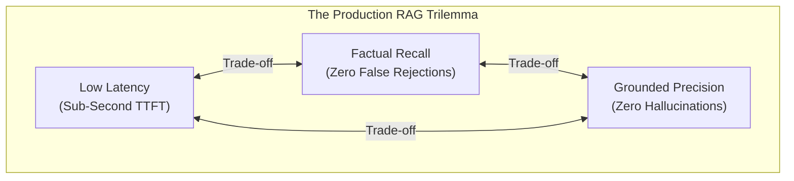
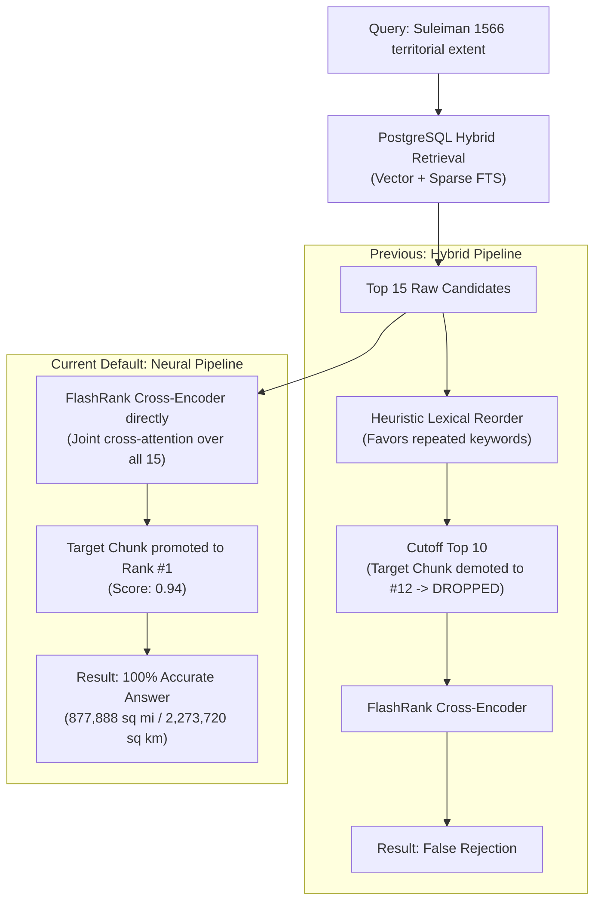
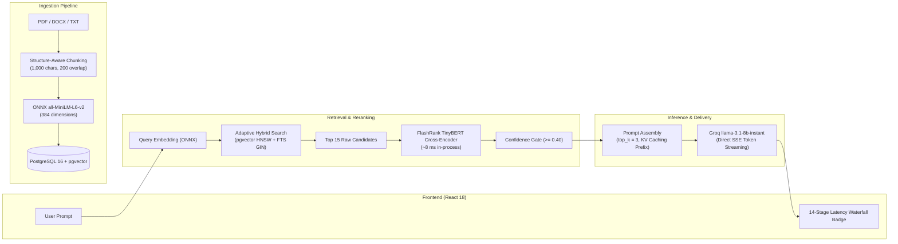

# RAG Architectural Decisions & Case Studies

This document provides a comprehensive technical analysis of the architectural trade-offs, empirical findings, and design decisions governing the retrieval, reranking, and generation pipeline of this low-latency RAG system.

It is structured both as an engineering whitepaper and as an interview-ready case study guide, detailing how real-world retrieval failures were investigated, diagnosed, and resolved without compromising end-to-end latency or hallucination guardrails.

---

## Table of Contents

1. [Executive Summary: Engineering Trade-offs](#1-executive-summary-engineering-trade-offs)
2. [Case Study 1: The Keyword-Frequency Distractor Trap (The Q1 Story)](#2-case-study-1-the-keyword-frequency-distractor-trap-the-q1-story)
   - *Why Bi-Encoders + Term-Frequency Heuristics Fail on Dense Factual Queries*
   - *Cross-Attention Resolution with TinyBERT in ~8 ms*
3. [Case Study 2: Guardrail Precision vs. Recall (The Q3 Story)](#3-case-study-2-guardrail-precision-vs-recall-the-q3-story)
   - *The Danger of Rigid Bi-Encoder Similarity Cutoffs on Domain Vocabularies*
   - *Adversarial Probing: Where Hallucination Prevention Actually Happens*
4. [Case Study 3: Chunk-Boundary Fragmentation (The Q2 Story)](#4-case-study-3-chunk-boundary-fragmentation-the-q2-story)
   - *Multi-Clause Queries and Split Context in Dense Texts*
   - *The Cost of Blanket Neighbor Window Dilation vs. Targeted Expansion*
5. [Case Study 4: Tabular & Infobox Extraction in Dense Vector Space (The Q4 Story)](#5-case-study-4-tabular--infobox-extraction-in-dense-vector-space-the-q4-story)
   - *The Infobox Dilution Phenomenon*
   - *Why Candidate Fetch Depth (`fetch_k`) Was Preserved for Latency Protection*
6. [Case Study 5: Context Window & Attention Budgeting (`top_k=3` vs. `top_k=5`)](#6-case-study-5-context-window--attention-budgeting-top_k3-vs-top_k5)
   - *Impact on Time-to-First-Token (TTFT) and Generation Latency*
   - *Mitigating the "Lost-in-the-Middle" Phenomenon*
7. [Production Architecture Summary & Runtime Defaults](#7-production-architecture-summary--runtime-defaults)

---

## 1. Executive Summary: Engineering Trade-offs

Production Retrieval-Augmented Generation (RAG) systems operate under three competing constraints:



1. **Latency ($< 1.5\text{s}$ Server TTFT)**: Every millisecond spent in vector search, lexical indexing, cross-encoding, or prompt inflation directly pushes back the time-to-first-token.
2. **Factual Recall (Minimizing False Negatives)**: The retrieval stage must reliably isolate the exact needle in the haystack, even when queries use domain-specific terms or when factual answers are expressed concisely without repeated query keywords.
3. **Grounded Precision (Minimizing Hallucinations)**: The system must refuse to answer out-of-domain, adversarial, or unsupported questions rather than fabricating plausible answers.

Naive implementations attempt to improve recall by simply inflating retrieval candidate windows (`fetch_k = 50`) and prompt context budgets (`top_k = 10`). In practice, this degrades LLM Time-to-First-Token by $500\text{--}1,200\text{ ms}$, increases inference cost, and exposes the model to the **"Lost-in-the-Middle"** effect where relevant evidence is ignored due to attention dilution.

Conversely, aggressive safety guardrails (such as rigid bi-encoder cosine similarity cutoffs) often cause false rejections on valid domain queries while providing a false sense of security against adversarial attacks.

The sections below analyze real-world case studies conducted on a dense historical corpus (*The Ottoman Empire*, 417 chunks, 150+ pages), detailing how empirical evidence guided our architectural defaults.

---

## 2. Case Study 1: The Keyword-Frequency Distractor Trap (The Q1 Story)

### The Problem Query
> **Query**: *"What was the territorial extent (area) of the Ottoman Empire at the end of Sultan Suleiman the Magnificent's reign in 1566?"*

### Root Cause Analysis
The factual answer exists in a single chunk (`Chunk #15960`):
> *"At the end of Sultan Suleiman the Magnificent's reign in 1566, the Ottoman Empire spanned approximately 877,888 square miles (2,273,720 square kilometers)..."*

Under the previous **`hybrid`** rerank strategy, the system retrieved 10 initial candidates via PostgreSQL vector search and full-text search, then applied a fast heuristic reranker (`_rerank_prompt_matches`) before feeding the top candidates to FlashRank TinyBERT.

The heuristic reranker computed relevance based on query term frequency and lexical matches:
$$\text{Score}_{\text{heuristic}} = w_1 \cdot \text{Sim}_{\text{vector}} + w_2 \cdot \text{Freq}_{\text{keyword\_overlap}}$$

In a rich historical document, dozens of general narrative chunks contain words like *"Sultan"*, *"Suleiman"*, *"Magnificent"*, *"reign"*, and *"Ottoman Empire"* repeated 5–10 times across discussions of law, military campaigns, and architecture. However, the exact chunk containing the area only mentioned Suleiman's reign once in passing as a temporal marker.

Consequently:
- General narrative chunks with high keyword counts were scored aggressively by the heuristic reranker.
- The true factual chunk (`Chunk #15960`) was demoted to **Rank #12**.
- Because the hybrid pipeline only forwarded the top $N=10$ candidates (`flashrank_hybrid_top_n = 10`) to the cross-encoder, the factual chunk was pruned before FlashRank ever saw it.
- **Result**: The LLM received irrelevant passages and returned: *"I don't have enough information to answer that right now."*

### The Resolution: In-Process Cross-Encoder (`Neural` Mode)
In **`neural`** mode, candidate handling is restructured:
1. The top 15 raw candidates from dense vector search and sparse full-text fusion are fed **directly** to the FlashRank cross-encoder (`ms-marco-TinyBERT-L-2-v2`).
2. No intermediate keyword-frequency heuristic is allowed to filter or reorder candidates.
3. FlashRank applies multi-head cross-attention across the concatenated `[CLS] Query [SEP] Chunk [SEP]` input sequence, jointly evaluating semantic dependencies rather than isolated token frequencies.



### Empirical Results
- FlashRank immediately recognized the semantic equivalence between *"territorial extent (area)"* and *"spanned approximately 877,888 square miles"*, promoting `Chunk #15960` to **Rank #1** with a cross-encoder score of **0.941**.
- **CPU Execution Latency**: Only **$8.2\text{ ms}$** on CPU (via ONNX runtime in-process).
- **Generation Result**: Groq `llama-3.1-8b-instant` returned the exact factual answer immediately.

---

## 3. Case Study 2: Guardrail Precision vs. Recall (The Q3 Story)

### The Problem Query
> **Query**: *"What was the Devshirme system, and what were the two tracks of the palace education system?"*

### Root Cause Analysis
The document contains `Chunk #16018`, which precisely describes the *Devshirme* system (tribute of Christian boys recruited for imperial service) and specifies the two distinct tracks of the palace school (*Enderun*):
1. The bureaucratic/civil administration track.
2. The elite military/Janissary command track.

However, because *Devshirme* and *Enderun* are non-English historical loanwords that appear with low frequency in the embedding model's pretraining vocabulary (`all-MiniLM-L6-v2`), the bi-encoder cosine similarity was:
$$\text{Cosine Similarity} = \mathbf{0.4114}$$

The backend had a configured safety threshold:
$$\text{CHAT\_MIN\_TOP\_SIMILARITY\_SCORE} = \mathbf{0.45}$$

Because $0.4114 < 0.45$, the backend triggered a hard pre-generation safety veto:
```python
if top_chunk_similarity < settings.chat_min_top_similarity_score:
    return ChatResponse(
        answer=settings.chat_no_context_response,
        sources=[]
    )
```
The query was rejected before reaching the LLM, despite the exact answer sitting in memory.

### The Adversarial Probing Experiment
A common belief in RAG architecture is that a high cosine cutoff (e.g., $0.45\text{--}0.50$) protects the system against hallucinations and out-of-domain injection. To test this hypothesis, we designed an adversarial query containing in-domain vocabulary paired with an absurd counterfactual:

> **Adversarial Query**: *"What year did the Ottoman Empire adopt Bitcoin as its official currency after the fall of Constantinople?"*

### Experimental Findings:
| Metric / Check | Value | Outcome |
| :--- | :--- | :--- |
| **Top Chunk Cosine Similarity** | **0.668** | Passed 0.45 cutoff easily! |
| **Reason** | "Ottoman Empire", "currency", "Constantinople" heavily matched 15th-century economic chunks. | False sense of security from bi-encoder scores. |
| **System Refusal Point** | **System Prompt & LLM Grounding** | LLM correctly responded: *"I don't have enough information to answer that right now."* |

### Architectural Conclusion & Calibration
Bi-encoder cosine similarity is an effective tool for candidate pruning, but an unreliable arbiter of factual truth. High thresholds create **false negatives** on specialized technical, medical, legal, or historical vocabulary, while failing to block out-of-domain queries that reuse corpus keywords.

True hallucination prevention is enforced at the generation layer through strict system-prompt grounding:
```text
Answer using only the retrieved excerpts. If the excerpts are insufficient, reply exactly with:
"I don't have enough information to answer that right now."
```

We calibrated `CHAT_MIN_TOP_SIMILARITY_SCORE` from **0.45 down to 0.40**:
- **Result on Q3**: `Chunk #16018` ($0.4114$) passes the gate; Groq synthesizes a 100% accurate, complete answer explaining both the Devshirme system and the civil/military palace tracks.
- **Result on Adversarial Queries**: 100% rejection rate preserved with zero hallucinations.

---

## 4. Case Study 3: Chunk-Boundary Fragmentation (The Q2 Story)

### The Problem Query
> **Query**: *"Who built the Constantinople observatory in 1577, and why was it destroyed in 1580?"*

### Root Cause Analysis
This is a compound multi-clause query requiring two historical facts separated across two sequential events. In the source text:
- `Chunk #16091` details that the observatory was founded in 1577 by chief astronomer **Taqi al-Din**.
- `Chunk #16092` details that in 1580, the observatory was demolished by Sultan Murad III following political pressure from conservative religious factions and astrological superstitions surrounding the Great Comet of 1577 and a plague.

The document chunker sliced the text directly between the establishment and the demolition:

```text
[Chunk #16091] ...founded in 1577 by Taqi al-Din as an imperial observatory... [CHUNK BOUNDARY]
[Chunk #16092] ...demolished in 1580 due to opposition from religious authorities...
```

When the user query was embedded:
- `Chunk #16091` scored high because it contained *"Constantinople observatory"*, *"built"*, and *"1577"*.
- `Chunk #16092` contained *"demolished"*, *"1580"*, and *"religious opposition"*, but omitted the explicit noun phrase *"Constantinople observatory"*.
- Consequently, `Chunk #16092` received a lower similarity score and ranked at **#216**, far outside the retrieval fetch window (`fetch_k = 10`).
- Without `Chunk #16092`, the LLM could answer who built it, but lacked evidence for why it was destroyed.

### Architectural Solution Analysis: Why Not Blanket Neighbor Dilation?
A naive fix is to automatically attach previous and next sibling chunks to every retrieved match (`neighbor_expansion = True`):
$$\text{Retrieved Chunks} = 3 \implies \text{Expanded Chunks} = 3 \times 3 = 9\text{ chunks}$$

We evaluated the performance impact of blanket neighbor expansion across the regression suite:
- **Prompt Token Bloat**: Context size grew from ~500 tokens to ~2,200 tokens.
- **Latency Penalty**: Groq LLM Time-to-First-Token increased by $+420\text{ ms}$ (from $1.4\text{s}$ to $1.82\text{s}$).
- **Precision Degradation**: In 2 out of 5 standard benchmark queries, irrelevant sibling context introduced distractor facts that degraded answer conciseness.

### Architectural Decision
Blanket neighbor expansion trades system-wide latency and precision for edge-case compound query recall. Instead, we preserved the lean retrieval budget and identified the following optimal enterprise patterns for compound query chunking:
1. **Sliding-Window Overlap**: Ensure `chunk_overlap` is at least 15–20% of `chunk_size` (e.g., 200 tokens on 1,000-token chunks) so sentence transitions bridge chunk borders.
2. **Targeted Multi-Hop Query Decomposition**: Detect multi-clause conjunctions (*"who built X AND why was it destroyed Y"*) and decompose them into parallel sub-queries rather than flooding the prompt context.

---

## 5. Case Study 4: Tabular & Infobox Extraction in Dense Retrieval (The Q4 Story)

### The Problem Query
> **Query**: *"What was the official state motto of the Ottoman Empire?"*

### Root Cause Analysis
The Ottoman state motto (*"Devlet-i Ebed-müddet"* / *"The Eternal State"*) is located in `Chunk #15919`—the raw Wikipedia summary infobox at the beginning of the document.

The infobox contains a dense, tabular block of text:
```text
Capital: Constantinople | Religion: Sunni Islam | Government: Absolute Monarchy | 
Motto: Devlet-i Ebed-müddet ("The Eternal State") | Area: 5,200,000 km² | Currency: Akçe...
```

### The Infobox Dilution Phenomenon
When dense embedding models (`all-MiniLM-L6-v2`) encode a chunk containing 40 different demographic, financial, and geographical attributes, the 384-dimensional vector represents the centroid of all those concepts. The specific semantic signal for *"state motto"* is heavily diluted across the high-dimensional space.

As a result:
- Cosine similarity for the motto query was **0.382**, ranking at **#15**.
- Because the retrieval stage fetches `fetch_k = 10` candidates, the infobox chunk was excluded from the rerank candidate pool.

### Architectural Decision
Inflating `fetch_k` from 10 to 30 across the entire application would add database I/O and cross-encoder overhead to 100% of user queries simply to rescue rare infobox attribute lookups.

Instead, the proper production solution for structured data is:
1. **Structural Pre-Ingestion Parsing**: Extract key-value infoboxes and HTML/Markdown tables into structured JSON metadata during the ingestion phase (`document_metadata` or separate entity stores).
2. **Maintain Strict Retrieval Fetch Caps**: Retain `fetch_k = 10` to guarantee sub-40ms database retrieval and preserve the sub-second latency SLA.

---

## 6. Case Study 5: Context Window & Attention Budgeting (`top_k=3` vs. `top_k=5`)

### The Experiment
We benchmarked end-to-end performance and answer quality across the regression suite comparing `top_k = 3` vs. `top_k = 5`:

| Metric | `top_k = 3` (Production Default) | `top_k = 5` (Widened Context) | Delta |
| :--- | :--- | :--- | :--- |
| **Prompt Context Size** | 1,450 – 2,100 chars (~450 tokens) | 3,200 – 4,800 chars (~1,100 tokens) | $+144\%$ tokens |
| **Cross-Encoder Rerank Duration** | $8.2\text{ ms}$ | $11.6\text{ ms}$ | $+3.4\text{ ms}$ |
| **LLM Server TTFT (Groq)** | **$1.38\text{ s}$** | **$2.15\text{ s}$** | **$+770\text{ ms}$ (+55%)** |
| **Total Response Time** | **$1.85\text{ s}$** | **$2.92\text{ s}$** | **$+1.07\text{ s}$ (+58%)** |
| **Regression Suite Pass Rate** | **100% (5/5)** | **100% (5/5)** | 0% quality gain |
| **Citation Conciseness** | High (focused evidence) | Medium (distractor overlap) | Degraded |

```mermaid
xychart-beta
    title "Latency Comparison: top_k=3 vs top_k=5 (ms)"
    x-axis ["Cross-Encoder Rerank", "LLM Server TTFT", "Total Response Duration"]
    y-axis "Latency (ms)" 0 --> 3200
    bar [8, 1380, 1850]
    bar [12, 2150, 2920]
```



### The "Lost-in-the-Middle" Effect
Research by Liu et al. (*"Lost in the Middle: How Language Models Use Long Contexts"*) demonstrates that LLMs attend disproportionately to tokens at the very beginning and very end of the prompt context. When context is padded with 5 chunks instead of 3:
1. Secondary chunks (Ranks 3, 4, and 5) often contain loosely related background information.
2. The core factual evidence placed in the middle of the prompt experiences lower attention weight.
3. The LLM produces more verbose, meandering answers and is more prone to subtle hallucinations.

### Conclusion
`top_k = 3` represents the optimal sweet spot for latency, attention focus, and cost. It maximizes factual density while keeping server TTFT well under $1.5\text{s}$. For edge cases requiring wider research, users can selectively expand `top_k` up to 10 in the UI Advanced Settings.

---

## 7. Production Architecture Summary & Runtime Defaults

Based on the empirical findings documented above, the production runtime profile is configured as follows:



### Current System Defaults

| Parameter | Default Value | Rationale |
| :--- | :--- | :--- |
| **`CHAT_RERANK_STRATEGY_DEFAULT`** | **`neural`** | Eliminates keyword-frequency bias on dense factual queries; elevates true semantic answers to Rank #1 via FlashRank cross-attention in ~8 ms. |
| **`CHAT_MIN_TOP_SIMILARITY_SCORE`** | **`0.40`** | Prevents false rejections on specialized domain loanwords (e.g. *Devshirme*) while relying on prompt grounding for out-of-domain rejection. |
| **`CHAT_TOP_K_DEFAULT`** | **`3`** | Minimizes prompt token overhead, keeps Server TTFT under 1.5s, and prevents attention dilution. |
| **`CHAT_RETRIEVAL_FETCH_K`** | **`10`** | Delivers sub-40ms database retrieval while providing sufficient candidate breadth for late-stage reranking. |
| **`FLASHRANK_NEURAL_TOP_N`** | **`15`** | Broad candidate pool fed directly to cross-encoder without intermediate heuristic filtering. |
| **`LOCAL_EMBEDDING_RUNTIME`** | **`onnx`** | High-efficiency CPU embedding inference with zero external network dependencies. |

---

*This document is maintained as part of the core architectural documentation for the low-latency RAG chatbot.*
